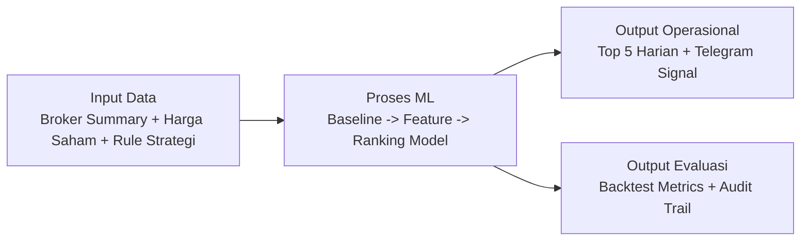
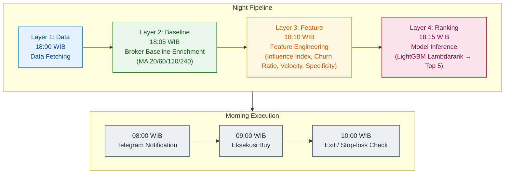

# PRD: BPJS Screener

## 1) What?

Sistem screener fully-automated untuk saham IDX non-blue chip yang mengeksekusi strategi **Beli Pagi, Jual Sore** secara disiplin. Setiap malam sistem memproses data broker, menghasilkan ranked list 5 saham, dan mengirimkan notifikasi eksekusi via Telegram. User tidak perlu berpikir — cukup ikuti instruksi.

Window eksekusi MVP: **Beli di opening 09:00 WIB, evaluasi sampai 10:00 WIB** (target +3% atau stop-loss -3%, mana yang lebih dulu).

### Background

Pasarnya Indonesia punya karakteristik unik: likuiditas terkonsentrasi di saham blue chip, namun return terbesar sering muncul di saham second-liner yang digerakkan oleh aksi broker tertentu. Fenomena ini jarang tertangkap oleh indikator teknikal klasik karena driver utamanya bukan retail — melainkan aliran dana institusional yang terdeteksi melalui data broker summary.

BPJS Screener lahir dari observasi bahwa pergerakan harga saham second-liner di window pagi (09:00–10:00) memiliki korelasi empiris yang bisa diukur dengan aktivitas broker di hari sebelumnya. Ini bukan teori — ini harus dibuktikan melalui data.

### Objective

1. Jam 08:00 WIB setiap hari: user menerima ranked list 5 saham via Telegram
2. Eksekusi equal-weight, tidak ada keputusan manual
3. Target sinyal MVP: memaksimalkan probabilitas return **>= +3%** pada window 09:00–10:00
4. Stop-loss absolut -3% per saham, cutoff evaluasi jam 10:00 WIB
5. **Zero cognitive load** — user tidak menganalisa, tidak memilih, hanya eksekusi

### Input

- **Data broker summary (sumber: sssaham/IPOT):** siapa broker yang beli/jual saham apa, berapa besar nilainya, dan kapan transaksinya.
- **Data harga saham (sumber: OHLCV market feed):** harga open, high, low, close, volume untuk menghitung hasil real di hari berikutnya.
- **Daftar universe saham:** fokus ke saham IDX non-blue chip yang memenuhi filter likuiditas minimum.
- **Aturan strategi:** jam entry, jam exit, stop-loss, dan jumlah saham top pick per hari.

### Output

- **Top 5 saham harian (ranked):** daftar kandidat terbaik hasil scoring model untuk dieksekusi besok pagi.
- **Sinyal eksekusi yang mudah dibaca:** ticker, alasan singkat (score), jam entry, jam exit, dan batas stop-loss.
- **Notifikasi Telegram jam 08:00 WIB:** format siap pakai, jadi user tinggal eksekusi.
- **Laporan performa periodik:** win-rate, average return, drawdown, dan perbandingan terhadap benchmark.
- **Audit trail data:** file parquet/log agar keputusan model bisa ditelusuri ulang.

### Visualisasi Input -> Proses ML -> Output

## 2) Why?

Untuk profitable dalam trading saham IDX tanpa keterlibatan emosional, tanpa over-analyzing, dan tanpa bergantung pada intuisi yang terbukti gagal berulang kali di market yang tidak efisien ini.

### Problem statement

1. **Market Indonesia tidak efisien** — price discovery tidak sepenuhnya digerakkan oleh fundamental atau teknikal, melainkan oleh konsentrasi aksi broker tertentu di saham-saham tertentu
2. **Price action murni tidak cukup** — candlestick, RSI, MACD di saham second-liner sering memberikan false signal karena volume rendah dan mudah dimanipulasi
3. **Korelasi bandar-harga belum terkuantifikasi** — kita tahu "bandar beli, harga naik" secara anekdotal, tapi tidak ada angka probabilitasnya. Berapa persen win-rate jika broker X akumulasi saham Y selama 3 hari? Tidak ada yang jawab secara empiris
4. **Tidak ada jawaban untuk pertanyaan alokasi** — "broker X beli saham Y hari ini, besok naik nggak?" itu pertanyaan biner yang kurang berguna. Pertanyaan yang benar: *"jika broker X beli saham Y hari ini, berapa probabilitas return harga saham Y mencapai +3% pada window 09:00–10:00 besok? Dan berapa besar dana yang harus dialokasikan?"*

## 3) How?

Dokumen turunan yang terkait langsung dengan lapisan baseline:
- [PRD 0001 — Broker Enrichment](./0001_broker_enrichment.md) untuk requirement detail Layer 2 (baseline MA broker dan broker-ticker).
- [PRD 0002 — Training Datamart](./0002_training_datamart.md) untuk kontrak dataset siap-train (label + training table).

### Correlation Definition (Broker vs Harga)

Definisi korelasi di PRD ini adalah hubungan empiris aktivitas broker pada hari `T` terhadap outcome harga saham pada hari `T+1` di window intraday yang ditentukan.

1. Unit observasi: `(date=T, broker, ticker)`.
2. Event broker (signal): akumulasi broker dari `net_buy`, `velocity`, `specificity`, dan `churn-adjusted influence`.
3. Outcome harga (target MVP): pada hari `T+1`, window `09:00-10:00 WIB`, label utama binary apakah `close@10:00 >= open@09:00 * 1.03`.
4. Metrik utama: `conditional win-rate`, `lift vs baseline`, stabilitas rolling window, dan metrik ranking (`NDCG/Precision@K`).
5. Validasi minimum: hanya profil broker dengan sampel event di atas `n_min` dan confidence interval yang cukup ketat.
6. Guardrails: no-lookahead, split wajib time-based/walk-forward, aturan universe-eksekusi konsisten antara train dan backtest.

### How this work

Sistem terdiri dari 4 lapisan yang berjalan secara berurutan setiap malam:

**Lapisan 1 — Data:** Pull broker summary dari sssaham/IPOT, gabungkan dengan OHLCV dari yfinance. Semua disimpan dalam format Parquet, satu baris per broker per ticker per hari.

**Lapisan 2 — Baseline:** Setiap broker diberikan moving average net buy di dua level: keseluruhan (broker-level) dan spesifik per emiten (broker-ticker level). Ini menjawab: *"apakah aktivitas broker ini hari ini normal atau anomali?"*

**Lapisan 3 — Feature Engineering:** Dari baseline, lahir fitur-fitur turunan:
- **Velocity:** lonjakan aktivitas hari ini vs MA historis
- **Specificity Ratio:** seberapa fokus broker ke emiten ini vs seluruh market
- **Churn Ratio:** gross volume / net volume (mengeliminasi scalper)
- **Influence Index:** kombinasi velocity × win-rate / churn (score akhir per broker)
- Semua fitur broker kemudian **diagregasi menjadi tepat 1 baris per emiten** (1-Row Rule)

**Lapisan 4 — Ranking:** LightGBM Lambdarank menerima 1 baris per emiten, meranking seluruh universe saham non-blue chip, mengeluarkan Top 5.

### How it helps

1. **Menghilangkan bias emosional** — keputusan murni berbasis angka, tidak ada "kayaknya besok naik"
2. **Mengukur yang tidak terukur** — mengubah aktivitas broker yang sebelumnya hanya bisa diamati secara kualitatif menjadi angka probabilitas
3. **Backtestable** — setiap asumsi bisa diuji dengan walk-forward validation terhadap data historis
4. **Scalable** — kalau suatu hari sistem tidak menemukan kandidat yang memenuhi threshold, sistem bilang "tidak beli hari ini" — bukan memaksa masuk posisi

### How to build this

Build dilakukan dalam 5 fase berurutan. Setiap fase harus selesai dan tervalidasi sebelum masuk fase berikutnya. Tidak ada paralel work.

**Fase 0 — Data Warehouse & Baseline Enrichment**
- Pull historis broksum dari IPOT, target minimal 240 trading days
- Simpan sebagai `master_broker.parquet`
- Enrich dengan MA 20/60/120/240 di dua level (broker & broker-ticker)
- Output: `master_broker_enriched.parquet`
- *Checkpoint:* NaN distribution wajar, tidak ada look-ahead bias, row count konsisten
- Detail requirement teknis fase ini: lihat [PRD 0001 — Broker Enrichment](./0001_broker_enrichment.md)

**Fase 1 — Empirical Broker Profiling**
- Rolling window analysis: jika broker X akumulasi saham Y selama T hari (T = 1, 3, 5), berapa persentase return mencapai +3% di window pagi hari T+1 (09:00–10:00)?
- Hasilnya menjadi kamus broker: setiap broker mendapat win-rate empiris dan multiplier (1.5x untuk Proven Catalyst, 0.1x untuk Late Follower)
- Output: `broker_kamus.parquet`
- *Checkpoint:* distribusi label broker masuk akal (tidak semua jadi catalyst, tidak semua jadi follower)

**Fase 2 — Feature Engineering**
- Hitung Influence Index = (Velocity × WinRate) / Churn × Multiplier
- Hitung fitur market context: buyer vs seller count ratio, smart money concentration
- Agregasi ke 1 baris per emiten per hari
- Output: `features_1row.parquet`
- *Checkpoint:* 1 baris = 1 emiten = 1 hari, tidak ada duplikat

**Fase 3 — Labeling & Model Training**
- Label MVP: apakah `close@10:00` hari T+1 mencapai ≥ +3% dari `open@09:00`? (binary)
- Train LightGBM Lambdarank dengan walk-forward validation (dilarang random split)
- Output: model file + backtest metrics
- *Checkpoint:* backtest menunjukkan positive edge di atas benchmark (IHSG/hold)

**Fase 4 — Production & Notification**
- Automasi inference pipeline harian (cron/scheduler)
- Integrasi Telegram bot
- Output: notifikasi harian jam 08:00 WIB
- *Checkpoint:* end-to-end test berhasil tanpa error selama 5 hari berturut-turut
