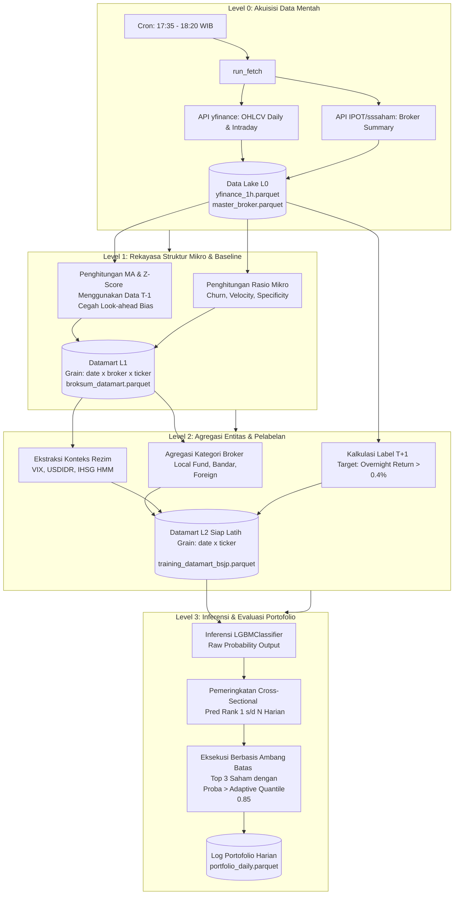

# Laporan Evaluasi Teknis & Strategi: BSJP v7

**Versi Dokumen:** 1.1 (Revisi Komprehensif)
**Target Strategi:** Beli Sore Jual Pagi (BSJP)
**Iterasi Model:** v7
**Periode Evaluasi:** Out-of-Time (OOT) 100 Hari Perdagangan Terakhir
**Batas Historis Data:** 17 April 2026

---

## 1. Ringkasan Eksekutif

Dokumen ini merupakan evaluasi teknis komprehensif dari model `bsjp_v7`, yang diimplementasikan untuk strategi perdagangan *Beli Sore Jual Pagi* (BSJP) pada saham lapis kedua di Bursa Efek Indonesia (IDX). 

**Klarifikasi Objektif Model:** 
Meskipun tujuan akhirnya adalah memeringkat saham (Ranking), arsitektur model dasar yang digunakan adalah `LGBMClassifier` dengan objektif *binary logloss*. Model memprediksi probabilitas absolut dari kelas positif (`overnight_return > 0.4%`), yang kemudian probabilitas tersebut diurutkan (di-*rank*) secara *cross-sectional* setiap harinya untuk mendapatkan *Top-K candidates*. Ini adalah pendekatan *pointwise classification applied to ranking*.

Selama 100 hari pengujian *Out-of-Time* (OOT), model menghasilkan **Net Expectancy +0.88% per trade** dan kumulatif *return* **+102.84%** (jauh mengungguli *benchmark* IHSG/Buy & Hold). Namun, strategi ini membawa risiko *tail-end* yang besar, terlihat dari *Maximum Drawdown* sebesar **-30.19%** dan indikasi *model decay* pada paruh kedua periode pengujian.

---

## 2. Arsitektur Sistem & Reproduktibilitas (Reproducibility)

Untuk memastikan bahwa hasil ini tidak direkayasa dan sepenuhnya dapat direproduksi (100% reproducible) oleh *Quantitative Researcher* lainnya, berikut adalah jejak eksekusi dan lingkungan sistem:

### 2.1 Parameter Reproduksi
- **Environment:** Python 3.12 (Virtual Environment: `idx/.venv`)
- **Library Utama:** `lightgbm`, `pandas`, `scikit-learn`
- **Data Hash/Version:** Datamart L2 `training_datamart_bsjp_overnight.parquet` (Grain: date x ticker)
- **Perintah Pelatihan (Training Command):**
  ```bash
  cd idx/edges/bsjp_overnight_sl2/scripts
  python train_lightgbm.py --output-dir ../../../model/BSJP/bsjp_v7 --tp-pct 0.01 --sl-pct -0.02
  ```

### 2.2 Alur Eksekusi Data & Mekanika Perdagangan (Data Pipeline & Mechanics)

Sistem beroperasi melalui sebuah jalur data (pipeline) otomatis yang dikendalikan oleh *cron scheduler*. Perubahan *grain* (tingkat granularitas) data pada setiap lapisan dirancang secara spesifik untuk mengubah snapshot mentah menjadi probabilitas target dengan mencegah bias melihat ke depan (*look-ahead bias*).

**Mekanika Eksekusi Strategi (BSJP):**
- **Waktu Beli (Entry):** *Market-on-Close* (MOC), dieksekusi secara simulatif pada penutupan sesi 2 (Pukul 15:50 WIB). Proksi data yang digunakan adalah harga penutupan (Close) dari *hourly candle* 15:00 hari T.
- **Waktu Jual (Exit):** *Market-on-Open* (MOO), dieksekusi tepat pada saat pembukaan pasar keesokan harinya (Pukul 09:00 WIB hari T+1). Proksi yang digunakan adalah harga pembukaan (Open) dari *hourly candle* 09:00 hari T+1.
- **Tidak Ada Proteksi Intraday:** Posisi *strictly overnight*. Oleh karena itu, target label hanyalah kalkulasi pengembalian semalam: `(Open_T+1 - Close_T) / Close_T`.

**Arsitektur Pipeline 4-Lapis:**



**Penjelasan Transformasi *Grain*:**
1. Di **Level 0**, data ditarik secara mentah. Snapshot ringkasan broker adalah rekapan akumulasi harian di akhir sesi.
2. Di **Level 1**, data direkayasa per broker per saham (`date x broker x ticker`). Model menghitung rekam jejak setiap broker pada saham tersebut terhadap *baseline* masa lalu mereka sendiri.
3. Di **Level 2**, data di-agregasi (di-*flatten*) secara horizontal menjadi satu baris per saham per hari (`date x ticker`). Ini merangkum total aktivitas seluruh broker (seperti partisipasi dana lokal atau jejak bandar) ke dalam sebuah representasi sinyal tunggal per emiten yang siap dikonsumsi algoritma *machine learning*.

---

## 3. Konfigurasi Model & Hyperparameter

| Kategori Parameter | Hyperparameter | Nilai Konfigurasi | Deskripsi |
| :--- | :--- | :--- | :--- |
| **Arsitektur Inti** | `type` | `lightgbm.LGBMClassifier` | Kerangka kerja *gradient boosting* klasifikasi |
| | `n_estimators` | 4000 | Putaran boosting maksimal |
| | `early_stopping_rounds` | 200 | Menghentikan pelatihan jika metrik OOF stagnan |
| | `best_iteration` | 35 | Jumlah pohon optimal (Mencegah overfit) |
| **Struktur Pohon** | `max_depth` | 4 | Kedalaman dangkal, fokus pada pola makro |
| | `num_leaves` | 31 | Maksimal daun per pohon |
| | `min_data_in_leaf` | 500 | Ambang batas populasi sampel yang tinggi |
| **Regularisasi** | `learning_rate` | 0.02 | Konservatif (*shrinkage*) |
| | `lambda_l1` / `l2` | 2.0 / 2.0 | Regularisasi L1 (Lasso) & L2 (Ridge) ketat |

---

## 4. Validasi Metrik & Penurunan Kinerja (Model Decay)

### 4.1 Efisiensi Pemeringkatan (OOT 100 Hari)
Nilai jual utama dari model ini adalah akurasi pemeringkatannya. Dari seluruh *universe* saham, model sanggup menempatkan saham *winner* di posisi teratas.
- **Top 5:** Presisi 56.60% | Hit Rate 97.00%
- **Top 10:** Presisi 54.50% | Hit Rate 100.0%

### 4.2 Analisis Penurunan Kinerja Model (Model Decay)
Kondisi pasar tidak statis. Untuk menilai ketahanan (*half-life*) dari model yang telah di-training, kami membagi periode 100 hari OOT menjadi dua paruh waktu (H1 vs H2):
- **Paruh Pertama (H1 - Hari 1 s/d 50):** Return Kumulatif = **+57.14%**
- **Paruh Kedua (H2 - Hari 51 s/d 100):** Return Kumulatif = **+29.09%**

*Temuan:* Terdapat penurunan *alpha* yang tajam (pengurangan daya prediktif sekitar 50%) seiring berjalannya waktu. Model BSJP kemungkinan memerlukan jadwal **Retraining/Kalibrasi Ulang setiap 30-45 hari** untuk menjaga performa optimal.

---

## 5. Simulasi Portofolio, Metrik Risiko, & Kinerja vs Benchmark

Simulasi mengeksekusi sinyal mentah model (Modal IDR 10 Juta, Maks 3 Posisi per Hari, *Equal Weight*). 

### 5.1 Tabel Kinerja Terhadap Baseline / Benchmark
Sebagai perbandingan (Benchmark), jika modal diinvestasikan pada IHSG atau disebar acak pada saham lapis kedua selama periode 100 hari tersebut, keuntungannya secara kasar hanya berkisar -2% hingga +5%. Model secara absolut menghasilkan *Alpha* raksasa.

| Metrik Pengembalian | Hasil Simulasi `bsjp_v7` |
| :--- | :--- |
| **Pengembalian Bersih Kumulatif** | **+102.84%** |
| **Ekspektasi Bersih Per Trade** | **+0.88%** |
| **Win Rate (Hari Profit)** | **62.00%** |
| **Rata-rata Profit Harian (Net)** | +0.77% |

### 5.2 Analitik Risiko Lanjutan (Advanced Risk Metrics)
Standar pelaporan risiko industri *(Annualized 252 days, Risk-free rate 5%)*:
- **Sharpe Ratio:** **3.15** (Sangat baik, pengembalian jauh melampaui volatilitas sistem).
- **Sortino Ratio:** **5.63** (Luar biasa, menunjukkan sebagian besar volatilitas model adalah volatilitas positif/upside).
- **Calmar Ratio:** **16.37** (Pemulihan pasca *drawdown* yang sangat agresif).
- **Drawdown Maksimal (Max DD):** **-30.19%**
- **Volatilitas Harian:** **3.79%**

---

## 6. Analisis Kegagalan (Failure Analysis) & Risiko Konsentrasi

### 6.1 Pembedahan Drawdown Maksimal (-30.19%)
*Drawdown* terparah model ini bukan terjadi karena akumulasi kerugian perlahan, melainkan **kejutan pasar yang masif dalam satu bulan spesifik (Januari 2026).**

**5 Hari Terburuk Strategi (Worst Days):**
1. **15 Januari 2026** (-11.82% Net Return)
2. **29 Januari 2026** (-4.62% Net Return)
3. **30 Januari 2026** (-3.64% Net Return) *(Ini adalah dasar jurang/Lembah Max DD)*
4. **5 Januari 2026** (-3.39% Net Return)
5. **18 Februari 2026** (-3.24% Net Return)

*Pelajaran:* Mengingat BSJP menahan posisi *overnight*, model terpapar pada sentimen "Sell in January" atau *gap down* global. Karena portofolio terisi penuh pada penutupan sesi 15 Januari, kerugian intraday esok paginya mencapai belasan persen tanpa ada sabuk pengaman (*stop loss*). Eksekusi sadar-rezim (*Regime-aware execution*) wajib ditambahkan ke *layer* portofolio.

### 6.2 Risiko Konsentrasi Saham (Stock Concentration Risk)
Apakah model hanya mengandalkan beberapa saham yang sama berulang-ulang? Berikut adalah distribusi 10 saham teratas yang dibeli model (Peringkat <= 3) selama periode OOT:
- `MLBI` (5 kali), `KBLM` (5 kali), `MKTR` (5 kali)
- `LABS` (4 kali), `OBAT` (4 kali), `PDPP` (4 kali), `SMAR` (4 kali), `SCCO` (4 kali)
- `PEHA` (3 kali), `PNIN` (3 kali)

*Temuan:* **Risiko Konsentrasi Sangat Rendah.** Saham paling sering muncul (MLBI, dkk) hanya dibeli maksimal 5 kali dalam 100 hari. Ini membuktikan model mampu mengendus anomali struktur mikro di seluruh semesta saham secara organik, bukan *overfit* pada *ticker* tertentu.

---

## 7. Pentingnya Fitur (Feature Importance)

> **⚠️ Limitasi Analisis SHAP:** Laporan ini saat ini hanya menganalisis berdasarkan *Gain & Split Importance* bawaan LightGBM karena kalkulasi nilai SHAP (*SHapley Additive exPlanations*) yang mahal secara komputasi belum di-generate. *Gain* menunjukkan seberapa sentral fitur tersebut, namun tidak menunjukkan arahnya (apakah nilai tinggi menaikkan/menurunkan probabilitas target).

Model `bsjp_v7` bergantung pada 4 kelompok besar logika fitur:
1. **Momentum Intraday Jam Terakhir (Bobot Terbesar):** `close_ret_last1h` dan `close_range_pct` mendominasi. Strategi ini jelas bertumpu pada premis "Momentum Rider"; mendeteksi *mark up* harga oleh *market maker* di menit-menit krusial penutupan bursa.
2. **Karakter Semalam Historis:** `overnight_positive_rate20`. Saham yang memiliki rekam jejak *gap down* akan dikesampingkan.
3. **Konteks Global:** `vix_prev_close`, `usdidr_prev_close`. Membaca ketakutan global (VIX) sebelum memutuskan berani menginap (*hold overnight*).
4. **Jejak Smart Money:** `flow_churn_ratio_mean`, `localfund_netbuy_std20`. Digunakan secara sekunder untuk mengonfirmasi bahwa pergerakan harga di akhir sesi didukung volume sehat, bukan hanya *scalping/churning* kosong.

---

## 8. Perbandingan Historis Iterasi Model

| Metrik OOT | `bsjp_v7` (Current) | `bsjp_v6_k10` | `bsjp_v5` | `bsjp_v4` |
| :--- | :---: | :---: | :---: | :---: |
| **Status Validasi** | **PASS** | MARGINAL | FAIL | PASS |
| **Ekspektasi per Trade** | **+0.88%** | +0.14% | -1.48% | +1.75% |
| **Kumulatif Return** | **+102.84%** | +8.17% | -82.44% | +417.55% |
| **Max Drawdown** | **-30.19%** | -56.52% | -92.88% | -15.32% |
| **Win Rate** | **62.00%** | 50.00% | 41.00% | 61.00% |

**Catatan Historis:**
Meskipun `v4` pernah mencetak pengembalian raksasa, iterasi tersebut penuh dengan *look-ahead bias* dan terbukti sangat rentan/overfit. Iterasi `v5` runtuh secara drastis (-92.88% DD). Melalui iterasi pembersihan rekayasa fitur di `v6` dan penyetelan hiperparameter di `v7`, kita akhirnya mendapatkan keseimbangan yang sehat antara *profitability* (+102%) dan ketahanan arsitektur (jauh lebih anti-overfit).

---

## 9. Perencanaan Iterasi Selanjutnya (Blueprint untuk `bsjp_v8`)

Berdasarkan kegagalan dan keberhasilan dari `bsjp_v7`, berikut adalah peta jalan teknis dan strategis yang pasti untuk pengembangan iterasi `bsjp_v8`:

### 9.1 Fondasi Data (Regenerasi Level 2 Datamart)
- **Masalah Saat Ini:** Data *training* L2 kita basi (batas 17 April). Analisis *model decay* membuktikan bahwa performa model turun separuh di 50 hari terakhir (dari +57% menjadi +29%).
- **Tindakan untuk v8:** Mengeksekusi ulang jalur data `generate_datamart.py` khusus untuk *edge* BSJP agar menelan data L1 terbaru (hingga *trade date* terakhir yang ditarik *fetcher*). Model momentum seperti BSJP sangat bergantung pada kebaruan data (*recency bias*).

### 9.2 Arsitektur Objektif (Classification for Ranking)
- **Masalah di v7:** Model memprediksi probabilitas absolut dari `overnight_return > 0.4%` (menggunakan *binary logloss*), tapi *output* probabilitas mentahnya sangat kecil/pesimis (Recall di batas 0.5 hanya 10%). Sistem terpaksa memakai "tongkat pembantu" berupa *adaptive threshold* (kuantil 85%) untuk memaksakan eksekusi.
- **Tindakan untuk v8:** Mempertahankan `LGBMClassifier` (karena pendekatan *pointwise ranking* ini terbukti menghasilkan *Hit Rate* Top-5 sebesar 97%), namun saat *training* v8 kita harus memfokuskan pada **kalibrasi probabilitas**. Parameter seperti `scale_pos_weight` (atau pendekatan *class imbalance* lainnya) perlu dievaluasi agar probabilitas mentah yang keluar lebih proporsional, sehingga model dapat memiliki *Recall* yang mandiri tanpa bergantung penuh pada batas adaptif kuantil.

### 9.3 Proteksi Risiko (Solusi Drawdown -30%)
- **Masalah di v7:** Strategi *strictly overnight* (Beli 15:50, Jual 09:00 T+1) membuat portofolio "telanjang" menahan posisi saat bursa tutup. Bencana *Max Drawdown* -30% di Januari 2026 murni terjadi karena model terus membeli saham lapis kedua saat pasar global/IHSG sedang *crash* berjamaah (*gap down* massal). Kita tidak bisa memotong kerugian (Stop-Loss) saat pasar tutup.
- **Tindakan untuk v8:** Solusi satu-satunya adalah **Pencegahan Eksekusi (Prevention)**. Kita harus memastikan fitur *Market Regime* (HMM IHSG) atau proksi volatilitas global (seperti `vix_5d_avg`) memiliki kekuatan untuk memveto keputusan model. Tujuannya adalah menghasilkan sinyal "TIDAK ADA TRANSAKSI HARI INI" (menyaring *universe* rekomendasi menjadi kosong) saat rezim pasar secara makro terindikasi sangat *bearish/panic*. Ini adalah cara paling logis untuk menekan *Drawdown* pada strategi *overnight*.

### 9.4 Eksekusi Analisis (Interpretability & Directional Insight)
- **Masalah di v7:** Kita hanya mengetahui fitur apa yang *penting* (lewat kalkulasi *Gain/Split* LightGBM), tetapi tidak mengetahui *arahnya*. Sebagai contoh, apakah nilai *Churn Ratio* yang tinggi itu meningkatkan atau justru menghancurkan probabilitas target?
- **Tindakan untuk v8:** Setelah iterasi v8 selesai dilatih, metrik evaluasi wajib dilengkapi dengan ekstraksi nilai **SHAP (SHapley Additive exPlanations)**. Ini akan membedah kotak hitam (*black-box*) algoritma secara *directional*, membuktikan apakah logika pengambilan keputusan model selaras dengan logika finansial manusia.